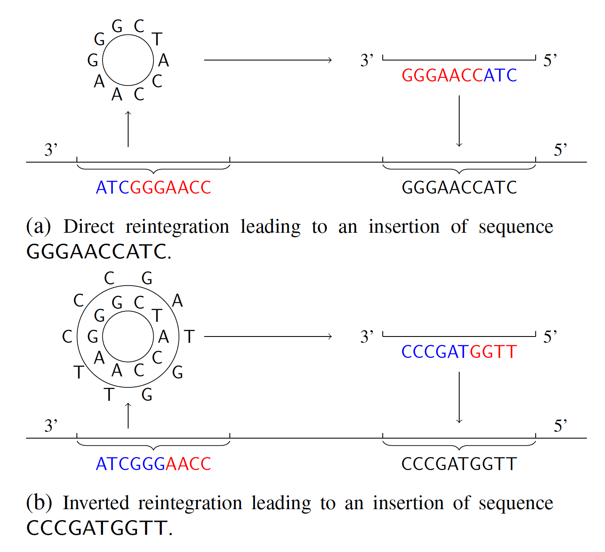

# Cicular Repeat Finder

## Purpose

MicroDNA is the most abundent type of extrachromosomal circular DNA (eccDNA). They are small in size and have been found in various eukaryotes ranging from yeasts to humans. MicroDNAs are thought to originate from genomic regions with active chromatin marks. To better understand the function of microDNAs, it is of interest to investigate their interaction with the chromosomal DNA, given the frequent presence of microDNAs in the nuclei of human and mouse cell lines. In particular, do microDNAs reintegrate back into the genome?

The goal of this algorithm is to provide an efficient algorithm to locate potential microDNA reintegration patterns within DNA sequences. A reintegration pattern is mathematically defined as a circular repeat, with form ...s<sub>1</sub>s<sub>2</sub>...s<sub>2</sub>'s<sub>1</sub>'... (direct circular repeat), or ...s1s2...s̅'<sub>2</sub>s̅'<sub>1</sub>... (inverted circular repeat), where s' denotes the approximate copy of s, and s̅ the reverse complement of s. The program takes a sequence as input, and output the circlar repeated pairs found by the algorithm in text files. Optional parameters for s<sub>1</sub>, s<sub>2</sub>, and mismatch ratio, and neighorhood size can also be specified. 

For large input sequences, memory requirement is often prohibitive too run the entire sequence. In such cases, we provide a helper program that partitions the long sequences into smaller sequences, and divide the original task into a set of smaller subtasks. This also provides a way to speed up the task by running the subtasks on multiple machines. 

The suffix array construction code is based on https://github.com/felipelouza/sacak-lcp.

Here is an illustration for circular repeats pattern:




## Getting Started

Enter the project directory, and generate the executable from code by using 
```
make
```
You should be able to get the following 2 executables: partition and CRPFinder.

## Preprocessing using Tandem Repeat Finder
It is important in the proprocessing step to remove (mask) the tandem repeat segments of the input DNA sequence using [Tandem Repeat Finder](https://github.com/Benson-Genomics-Lab/TRF). This is because tandem repeats trivially satifies the definition of circle repeats by definition. 

## Command Line Options for partition
The <code>partition</code> executable is used as a preprocessing step to for the <code>--partition</code> option in <code>CRPFinder</code> to deal with long input sequences. 

The partition executable takes 3 arguments:
* 1st argument: sequence file name
* 2nd argument: number of partitions 
* 3rd argument: name of the directory where the partitioned sequence files are stored

The this executable equally splits (execept the last one) the sequence into the specified amount of smaller sequences, and output those sequences into the specified directory.

## Command Line Options for mdf

The executable has 1 required argument, 1 argument from either <code>--single</code> or <code>--partition</code>, and 2 optional arguments:
* First argument (required): either "direct" or "inverted". 
<!---
If "direct", then the program will search direct circle repeats (of form "...s1s2...s2s1..."); if "reversed", the program will search reversed circle repeats (of form "...s1s2...s1^(-1)s2^(-1)...").
-->

* --single sequence_file_name 
<!---
The file should contain the DNA sequence in which you search the circle repeats; note that any characters that are not A, T, C, G are filtered out in the preprocessing.
-->
* --partition partition_file_dir task_numbers
* Optional argument: "--l1 minimum_first_level_maximal_repeat_length". Default value is 40.
* Optional argument: "--l2 minimum_second_level_maximal_repeat_length". Default value is 20.
* Optional argument: "--L extension_checking_length". Default value is 800.
* Optional argument: "--alpha max_mismatch_ratio_allowed". Default value of percentage mismatch is 0.1

For the <code>--partition</code> option, if there are <code>n</code> partition sequences, then the total number of tasks is <code>n*(n+1)/2</code> (each pair of partition sequence forms a task).  <code>task_numbers</code> can take the form of an inclusive range <code>x-y</code>; for example <code>3-6</code> specifies task 3,4,5,6. 

## Example
```
./CRPFinder direct --single your_seq_file.txt 
```

The above command searches for direct circle repeats in the sequence from file you_seq_file.txt with the default parameters.

```
./partition your_seq_file.txt 5 your_partition_dir
./CRPFinder direct --partition your_partition_dir 1-8
```

The above commands searches the sequence into 5 parts and output them to your_partition_dir. There are a total of 5*(5+1)/2=15 tasks, and CRPFinder searches for direct circle repeats in tasks 1 to 8 with the default parameters. Note if we set the tasks to <code>1-15</code>, then this commend is equivalent to the previous command.  


## Output File
There will be an index file as output in the result folder. Each circle repeat is represented by a 8-tuple.
* 1st: the start index of s1s2
* 2nd: the start index of s<sub>2</sub>'s<sub>1</sub>' (or s̅'<sub>2</sub>s̅'<sub>1</sub> if inverted)
* 3rd: length of s1 
* 4th: length of s2
* 5th: length of s<sub>1</sub>'
* 6th: length of s̅'<sub>2</sub>
* 7th: total mismatch ratio
* 8th: mismatch ratio for s1
* 9th: mismatch ratio for s2
* 10th: length of s<sub>1</sub>s<sub>2</sub>

## What's New

### Version 2.0

Suffix array replaces suffix tree for MRP search, increasing the memory efficiency 

### Version 2.1

Implemented inverted search with partition option


