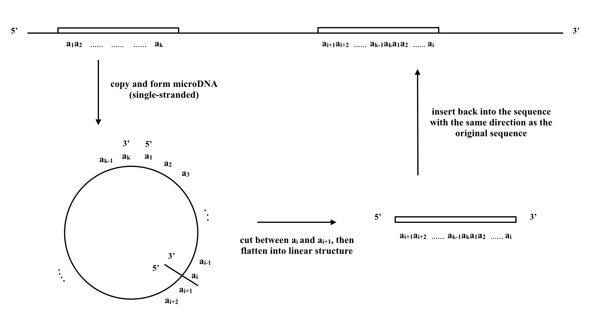
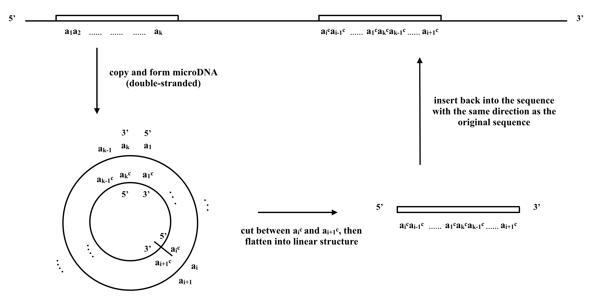

# MicroDNA_Detection

The goal of this project is to provide an efficient algorithm to locate potential microDNA reintegration pairs within DNA sequences. Each potential microDNA is mathematically defined as a circle repeat, with form "...s1s2...s2s1..." (direct circle repeat), or "...s1s2...s1's2'..." (reversed circle repeat), where s' denotes the reversed complement of s. The program takes a sequence as input, and output two text files that contains the circle repeats sequences found by the algorithm and as well as their locations in the sequence. A detailed description of the algorithm and problem description is included in the microDNA_Finder.pdf.

For large input sequences, memory requirement is often prohibitive too run the entire sequence. In such cases, the partition option should be used.  

The suffix tree construction code is based on https://github.com/shysaur/shysaur-suffixtrees.

Here is an illustration for direct microDNA reintegration pattern:


Here is an illustration for inverted microDNA reintegration pattern:



## Getting Started

Enter the project directory, and generate the executable from code by using 
```
make
```
You should be getting 2 executables: partition and mdf.

## Preprocessing using Tandem Repeat Finder
It is important in the proprocessing step to remove (mask) the tandem repeat segments of the input DNA sequence using Tandem Repeat Finder (TRF) https://tandem.bu.edu/trf/trf.html, because tandem repeats trivially satifies the definition of circle repeats by definition. 

## Command Line Options for partition
The partition executable takes 3 arguments:
* 1st argument: sequence file name
* 2nd argument: number of partitions
* 3rd argument: name of the directory where the splitted sequence files are stored

This executable is used as a preprocessing step to for the -t option. It is often used when the input sequence is long, to speed up the searching through parallelization or to deal with memory issue.

## Command Line Options for mdf

The executable has 1 required argument, 1 argument from either -t or -s, and 2 optional arguments:
* First argument (required): either "direct" or "reversed". 
<!---
If "direct", then the program will search direct circle repeats (of form "...s1s2...s2s1..."); if "reversed", the program will search reversed circle repeats (of form "...s1s2...s1^(-1)s2^(-1)...").
-->

* -s sequence file name. 
<!---
The file should contain the DNA sequence in which you search the circle repeats; note that any characters that are not A, T, C, G are filtered out in the preprocessing.
-->
* -t partition_file_dir task_numbers
* Optional argument: "-r minimum_first_level_maximal_repeat_length". Default value is 40.
* Optional argument: "-c minimum_second_level_maximal_repeat_length". Default value is 20.
* Optional argument: "-e extension checking length". Default value is 800.
* Optional argument: "-m percentage_mismatch_allowed". Default value of percentage mismatch is 0.1

## Example
```
./mdf direct -s you_seq_file.txt -r 40 -m 0.1
```

The above command searches for direct circle repeats in the sequence from file you_seq_file.txt, with minimum maximal repeat length 40, and allowed mismatch ration 10%.

## Output File
There will be an index file as output in the result folder. Each circle repeat is represented by a 8-tuple.
* 1st: the start index of s1s2
* 2nd: the start index of s2s1 (or s1's2' if reverse)
* 3rd: length of first s1
* 4th: length of first s2
* 5th: length of second s1
* 6th: length of second s2
* 7th: total mismatch ratio
* 8th: mismatch ratio for s1
* 9th: mismatch ratio for s2
* 10th: length of s1s2 (which is the same as s2s1 or s1's2', even if the two s1's and two s2's are not exact match)


